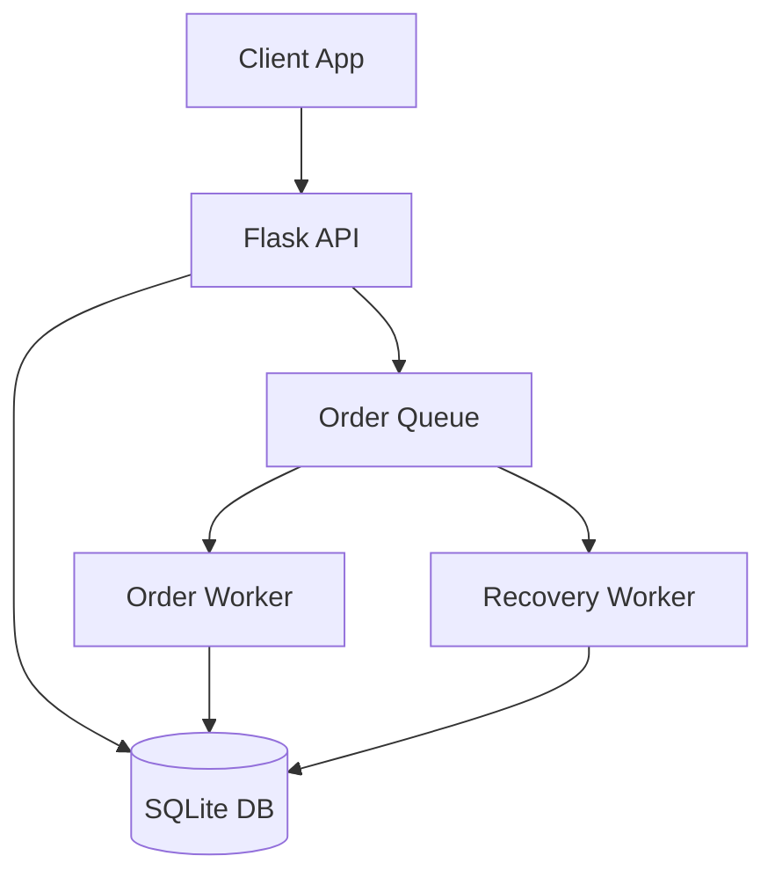
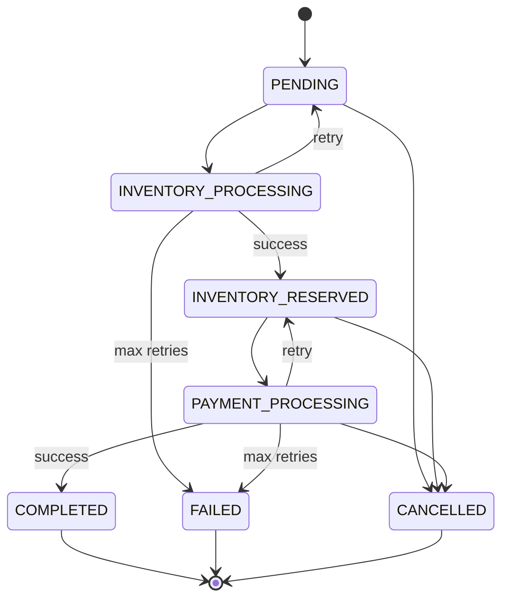

# Design Document: Flask Order Management System

## 1. System Architecture

**Layers:**

- **API Layer:** Flask app with Blueprints for order endpoints, input validation via Marshmallow.
- **Business Logic Layer:** Services for order processing, payment, and inventory.
- **Worker Layer:** Background workers for async order processing and recovery.
- **Data Layer:** SQLAlchemy models, SQLite database.

**Diagram:**



---

## 2. Order State Machine

**States:**

- PENDING → INVENTORY_PROCESSING → INVENTORY_RESERVED → PAYMENT_PROCESSING → COMPLETED/FAILED
- Orders can be CANCELLED from any non-terminal state.

**Diagram:**



---

## 3. Idempotency Design

- **Idempotency-Key** header required for order creation.
- If a request with the same key is repeated, the same order is returned (no duplicate orders).
- Enforced at the API and DB layer (unique constraint).

---

## 4. Retry Strategy

- **Inventory and Payment:** Each has a retry counter (max 3 by default).
- On failure, the order is re-queued for retry.
- If max retries are exceeded, order is marked FAILED.
- **Recovery Worker:** Scans for stuck orders and re-queues them, up to a max `recovery_attempts` (prevents infinite loops).

---

## 5. Concurrency Handling

- **Database Locking:** `with_for_update()` used to prevent concurrent processing of the same order.
- **Atomic Updates:** Order cancellation uses a conditional update to avoid race conditions with the worker.
- **Thread-Safe Queue:** Python’s `queue.Queue` ensures safe access by multiple threads.

---

## 6. Failure Scenarios (Project Specific)

- **Worker Crash:** Recovery worker re-queues stuck orders.
- **Database Unavailable:** API returns error, workers retry.
- **Queue Overflow:** All orders are in-memory; if the app crashes, queued orders are lost.
- **Max Recovery Attempts:** Orders stuck too long are marked FAILED.
- **Race Conditions:** Prevented by DB locking and atomic updates.

---

## 7. Order Cancellation Design

- **Endpoint:** `/orders/{id}/cancel`
- **Logic:** Only non-terminal orders can be cancelled.
- **Atomicity:** Uses a single SQL update with a WHERE clause to ensure the order isn’t already completed/failed/cancelled.
- **Idempotency:** Multiple cancel requests are safe.

---

## 8. Tradeoffs & Limitations

- **In-memory Queue:** Simple, but queued orders are lost on restart.
- **SQLite:** Easy to use, but not suitable for high concurrency or production at scale.
- **No External Integrations:** Payment/inventory are simulated, not real services.
- **No Authentication/Rate Limiting:** Not implemented, but can be added.
- **No Horizontal Scaling:** Single-process, single-machine design.
- **No Persistent Audit Log:** Logs are local only.

---

**This document describes only the features and design present in your project. All advanced, unimplemented, or hypothetical features have been removed.**

## Failure Scenarios & Recovery

### System Failure Modes

#### 1. **Worker Process Crash**

**Scenario**: Background worker process terminates unexpectedly during order processing.

**Impact**: Orders in progress may be left in intermediate states (INVENTORY_PROCESSING, PAYMENT_PROCESSING).

**Detection**: Worker health checks or missing heartbeat signals.

**Recovery Strategy**:

- Recovery worker scans for orders stuck in processing states
- Orders older than threshold are reset to previous stable state
- Automatic re-queuing for reprocessing
- Manual intervention for complex cases

**Prevention**:

- Graceful shutdown handling
- Process monitoring and auto-restart

#### 2. **Database Connection Loss**

**Scenario**: Database becomes temporarily unavailable due to network issues or maintenance.

**Impact**: All operations requiring database access fail.

**Detection**: Database connection errors or timeouts in logs.

**Recovery Strategy**:

- Application retries connection after a delay
- Manual intervention if outage persists

**Prevention**:

- Use a reliable database service
- Monitor database health

#### 3. **Inventory/Payment Service Failures**

**Scenario**: Internal logic for payment or inventory fails (e.g., simulated failure in service code).

**Impact**: Order processing stalls, affecting user experience.

**Detection**: Error logs and failed order status.

**Recovery Strategy**:

- Retry with exponential backoff (as implemented)
- Mark order as FAILED after max retries

**Prevention**:

- Test service logic thoroughly
- Monitor error logs

#### 4. **Queue Overflow**

**Scenario**: Order creation rate exceeds worker processing capacity.

**Impact**: Memory exhaustion, system slowdown, order delays.

**Detection**: High memory usage, slow processing.

**Recovery Strategy**:

- Restart application if memory is exhausted
- Manually clear queue if needed

**Prevention**:

- Monitor order volume
- Add queue size limits if needed

#### 5. **Data Corruption**

**Scenario**: Database corruption due to hardware failure or software bugs.

**Impact**: Loss of order data, inconsistent state.

**Detection**: Data integrity checks, checksum validation.

**Recovery Strategy**:

- Point-in-time recovery from backups
- Data reconciliation scripts
- Manual data repair procedures
- Service degradation during recovery

**Prevention**:

- Regular backups with integrity checks
- Database replication
- Data validation at application level
- Hardware redundancy

#### 6. **Race Conditions**

**Scenario**: Concurrent operations on same order (e.g., worker processing + user cancellation).

**Impact**: Inconsistent order state, lost updates.

**Detection**: State transition validation failures.

**Recovery Strategy**:

- Atomic operations with conditional updates
- Optimistic locking with version columns
- Conflict resolution policies
- Manual state correction

**Prevention**:

- Database-level locking (`SELECT FOR UPDATE`)
- Atomic conditional updates
- State machine validation
- Single-writer principle

#### 7. **Memory Leaks**

**Scenario**: Application memory usage grows over time due to improper resource management.

**Impact**: Performance degradation, eventual crashes.

**Detection**: Memory usage monitoring, performance metrics.

**Recovery Strategy**:

- Process restart (if stateless)
- Memory profiling and leak identification
- Garbage collection tuning
- Code fixes for resource leaks

**Prevention**:

- Memory profiling in development
- Resource cleanup in finally blocks
- Weak references for caches
- Regular memory monitoring

#### 8. **Network Partitioning**

**Scenario**: Network issues isolate parts of the system from each other.

**Impact**: Inconsistent views of order state across components.

**Detection**: Service health checks fail, timeout errors.

**Recovery Strategy**:

- Idempotent operations for safe retries
- Eventual consistency with conflict resolution
- Service discovery updates
- Manual failover procedures

**Prevention**:

- Circuit breakers and timeouts
- Retry logic with jitter
- Service mesh for resilience
- Multi-region deployment

### Recovery Time Objectives (RTO/RPO)

- **RTO (Recovery Time Objective)**: Time to restore service after failure
  - Database failure: 15-30 minutes (backup restore)
  - Service crash: 1-5 minutes (auto-restart)
  - Network partition: 5-15 minutes (circuit breaker recovery)

- **RPO (Recovery Point Objective)**: Maximum acceptable data loss
  - Transactional data: 0 (ACID compliance)
  - Audit logs: 1 hour (log aggregation delay)
  - Metrics: 5 minutes (collection interval)

### Disaster Recovery Plan

1. **Immediate Response**:
   - Alert on-call engineers
   - Assess impact and scope
   - Communicate with stakeholders

2. **Containment**:
   - Isolate affected components
   - Implement circuit breakers
   - Redirect traffic if possible

3. **Recovery**:
   - Follow specific recovery procedures
   - Validate system integrity
   - Gradual traffic restoration

4. **Post-Mortem**:
   - Root cause analysis
   - Documentation updates
   - Prevention measures

### Monitoring & Alerting Strategy

**Key Metrics to Monitor**:

- Order processing latency and throughput
- Error rates by component
- Queue depth and processing rates
- Database connection pool utilization
- External service response times
- Memory and CPU usage

**Alert Conditions**:

- Order processing > 5 minutes
- Error rate > 5% over 5 minutes
- Queue depth > 1000 orders
- Database connections > 90% utilization
- External service timeouts > 10%

**Alert Response**:

- Low urgency: Log and monitor trends
- Medium urgency: Investigate and potentially scale
- High urgency: Immediate engineering response
- Critical: Wake up on-call, prepare rollback

## Alternative Architectures Considered

### Event-Driven Architecture

**Considered Approach**: Use event sourcing with CQRS pattern, where order state changes emit events that drive processing.

**Pros**:

- Better audit trail and debugging capabilities
- Loose coupling between components
- Easy to add new event consumers (analytics, notifications)
- Natural support for eventual consistency

**Cons**:

- Higher complexity and learning curve
- Eventual consistency makes immediate reads challenging
- Requires additional infrastructure (event store, message broker)
- More difficult to implement transactional guarantees

**Why Rejected**: Overkill for current scale and requirements. Event sourcing would add significant complexity without proportional benefits for a single-instance system.

### Microservices Architecture

**Considered Approach**: Split into separate services (Order API, Payment Service, Inventory Service, Worker Service).

**Pros**:

- Independent scaling and deployment
- Technology diversity (different languages/frameworks per service)
- Fault isolation between services
- Easier testing and maintenance of individual components

**Cons**:

- Distributed system complexity (service discovery, inter-service communication)
- Eventual consistency challenges
- Increased operational overhead (monitoring, deployment, networking)
- Higher infrastructure costs

**Why Rejected**: Current scale doesn't justify the complexity. Monolithic approach provides better developer experience and simpler operations for a single-team project.

### Synchronous Processing

**Considered Approach**: Process orders synchronously in the API request, eliminating the need for background workers.

**Pros**:

- Simpler architecture (no queues, workers, or async processing)
- Immediate feedback to users
- Easier debugging and tracing
- No eventual consistency issues

**Cons**:

- Poor user experience for slow operations (payment processing can take seconds)
- API timeouts and failures under load
- Tight coupling between API and business logic
- Difficult to implement retries and compensation

**Why Rejected**: User experience requirements demand fast API responses. Synchronous processing would violate the core requirement of non-blocking order creation.

### Database-Per-Service

**Considered Approach**: Each service (orders, inventory, payments) has its own database.

**Pros**:

- Independent data evolution
- Better fault isolation
- Technology choice per service
- Reduced coupling between services

**Cons**:

- Complex data consistency (distributed transactions or sagas)
- Cross-service queries difficult
- Increased operational complexity
- Higher infrastructure costs

**Why Rejected**: Data relationships between orders, inventory, and payments require transactional consistency. Single database simplifies this while still allowing future decomposition.

### GraphQL API

**Considered Approach**: Replace REST API with GraphQL for more flexible data fetching.

**Pros**:

- Single endpoint for all data needs
- Client-driven data requirements
- Reduced over/under-fetching
- Strong typing with schema

**Cons**:

- Increased complexity for simple CRUD operations
- Caching challenges
- Security concerns (query complexity attacks)
- Steeper learning curve

**Why Rejected**: REST API adequately serves current needs. GraphQL would add complexity without significant benefits for this domain.

### Serverless Architecture

**Considered Approach**: Use AWS Lambda or similar for API and worker functions.

**Pros**:

- Automatic scaling
- Pay-per-use pricing
- Zero maintenance overhead
- Built-in fault tolerance

**Cons**:

- Cold start latency
- Vendor lock-in
- Complex local development
- Limited execution time
- Higher complexity for stateful operations

**Why Rejected**: Current operational model and team skills favor traditional server deployment. Serverless would require significant infrastructure changes.

### CQRS Pattern

**Considered Approach**: Separate read and write models with event sourcing.

**Pros**:

- Optimized reads and writes
- Rich domain modeling
- Easy to add new read models
- Better performance for complex queries

**Cons**:

- Significant complexity increase
- Eventual consistency challenges
- Requires event sourcing foundation
- Overkill for current data access patterns

**Why Rejected**: Read/write patterns are straightforward. CQRS would add complexity without performance benefits at current scale.

### Summary of Architectural Decisions

The chosen architecture balances simplicity, reliability, and performance for the current scale and team capabilities. More complex patterns (event sourcing, microservices, CQRS) were considered but rejected due to:

1. **Premature optimization**: Complex patterns add cost without immediate benefits
2. **Team expertise**: Current team is more productive with monolithic Flask applications
3. **Operational simplicity**: Single deployable unit reduces operational overhead
4. **Evolutionary design**: System can evolve toward more complex architectures as needs grow

The design follows the principle of "maximally simple design that works" while maintaining extensibility for future growth.

### Order Model Design

```python
class Order(db.Model):
    id: UUID (primary key)
    idempotency_key: String (unique, nullable)
    items: JSON (order items with quantities)
    status: String (enum-based status)
    payment_retry_count: Integer
    inventory_retry_count: Integer
    payment_reference: String (nullable)
    recovery_attempts: Integer (default: 0)
    created_at: DateTime
    updated_at: DateTime
```

**Design Choices & Rationale:**

- **UUID primary keys**: Chosen over auto-incrementing integers for global uniqueness and security (no predictable IDs)
- **JSON storage for items**: Flexible schema that can accommodate varying product structures without schema changes
- **Separate retry counters**: Granular tracking allows different retry limits for payment vs inventory failures
- **Recovery attempts counter**: Prevents infinite recovery loops by limiting how many times stuck orders are requeued
- **Automatic timestamps**: Audit trail for debugging and compliance requirements

**Tradeoffs:**

- **JSON vs normalized tables**: JSON is simpler but less queryable; normalized tables would be more complex but better for analytics
- **UUID vs integer IDs**: UUIDs are larger (128-bit vs 64-bit) but provide better security and distributed system compatibility
- **Recovery attempts vs time-based expiration**: Counter-based approach prevents recovery storms but requires database updates

**Failure Cases:**

- **Duplicate idempotency keys**: Handled by database unique constraint, returns existing order
- **Invalid JSON in items**: Marshmallow validation prevents malformed data at API level
- **Database corruption**: Alembic migrations provide rollback capability

### Queue Design

**Implementation**: Python's `queue.Queue` with custom wrapper for timeout and shutdown handling.

**Design Choices & Rationale:**

- **In-memory queue**: Simple, fast, and sufficient for single-instance deployment
- **Thread-safe by default**: Python's queue.Queue provides atomic operations
- **Timeout-based dequeuing**: Prevents workers from blocking indefinitely during shutdown
- **Single queue per worker type**: Dedicated queues allow different processing priorities

**Tradeoffs:**

- **In-memory vs persistent queue**: In-memory is faster but loses data on restart; persistent (Redis) adds complexity but improves reliability
- **Single queue vs multiple queues**: Single queue is simpler but can't prioritize urgent orders; multiple queues allow priority handling

**Failure Cases:**

- **Queue overflow**: Python's queue has no size limit by default, could cause memory issues under extreme load
- **Worker crash during processing**: Order remains in queue, processed by another worker (at-least-once delivery)
- **Application restart**: All queued orders lost, requiring manual recovery or persistent queue

### Worker Design

**Architecture**: Single-threaded workers with cooperative multitasking via timeouts.

**Design Choices & Rationale:**

- **One worker per order**: Ensures isolation - one failing order doesn't affect others
- **Database-level locking**: `with_for_update()` prevents concurrent processing of same order
- **Graceful shutdown**: Workers check shutdown flag between operations
- **Error isolation**: Worker failures logged but don't crash the entire system

**Tradeoffs:**

- **Threading vs multiprocessing**: Threading chosen for simplicity and shared memory; multiprocessing would be more robust but complex
- **Single worker vs worker pool**: Single worker per process is simpler but less efficient; pool would improve throughput but add coordination complexity

**Failure Cases:**

- **Worker crash mid-processing**: Order status remains unchanged, worker recovery system can restart processing
- **Database connection loss**: Worker retries with exponential backoff, eventually marks order as failed
- **External service timeout**: Worker implements timeout handling, retries or fails gracefully
- **Race conditions**: Database locking prevents concurrent modifications

### API Layer Design

**Framework**: Flask with Blueprint organization and Marshmallow validation.

**Design Choices & Rationale:**

- **Blueprint organization**: Modular routing that can be easily tested and maintained separately
- **Schema validation**: Marshmallow provides declarative validation with clear error messages
- **Idempotency at API level**: Prevents duplicate processing before it reaches business logic
- **RESTful design**: Standard HTTP methods and status codes for predictable client behavior

**Tradeoffs:**

- **Flask vs FastAPI**: Flask chosen for simplicity and ecosystem maturity; FastAPI would provide better async support but adds complexity
- **Schema validation in API vs business layer**: API validation provides faster feedback but duplicates some business rules

**Failure Cases:**

- **Invalid request format**: Marshmallow returns detailed validation errors
- **Database unavailable**: API returns 500 with retry guidance
- **Concurrent requests**: Idempotency keys prevent duplicate order creation
- **Large payloads**: No explicit size limits, could cause memory issues (should be added)

### Business Logic Layer Design

**Architecture**: Service-oriented design with clear separation of concerns.

**Design Choices & Rationale:**

- **Service classes**: Encapsulate external integrations and business rules
- **Retry logic with compensation**: Failed payments automatically release inventory
- **State machine approach**: Explicit status transitions prevent invalid state changes
- **Compensation transactions**: Failed operations are rolled back (inventory released, payments refunded)

**Tradeoffs:**

- **Monolithic services vs microservices**: Services are co-located for simplicity; microservices would provide better scalability but add distributed system complexity
- **Synchronous vs asynchronous external calls**: Synchronous chosen for simplicity; async would improve performance but complicate error handling

**Failure Cases:**

- **External service failures**: Retry logic with exponential backoff, eventual failure after max attempts
- **Partial failures**: Compensation logic ensures system remains consistent (e.g., failed payment releases inventory)
- **Network timeouts**: Configurable timeouts with retry logic
- **Inconsistent state**: State validation and atomic operations prevent invalid transitions

### Database Design

**Technology**: SQLite (single file, no clustering)

**Design Choices & Rationale:**

- **ACID compliance**: SQLite provides full ACID guarantees for data consistency
- **Migrations with Alembic**: Version-controlled schema changes with rollback capability
- **Connection management**: SQLAlchemy handles connections automatically

**Tradeoffs:**

- **SQLite**: Chosen for simplicity and ease of use; not suitable for high-concurrency production
- **ORM**: SQLAlchemy chosen for productivity and security

**Failure Cases:**

- **Database corruption**: Backup/restore procedures needed (not implemented)
- **Concurrent updates**: `with_for_update()` prevents lost updates
- **Migration failures**: Alembic provides rollback to previous schema version

### Logging and Monitoring Design

**Implementation**: Local logging to console or file.

**Design Choices & Rationale:**

- **Simple logging**: Uses Python's logging module for console/file output
- **Multiple log levels**: DEBUG for development, INFO/WARN/ERROR for production
- **Performance-conscious**: Logging doesn't block critical paths

**Tradeoffs:**

- **Synchronous logging**: Chosen for simplicity
- **Local logging**: No aggregation or external log management

**Failure Cases:**

- **Log file rotation**: No automatic rotation implemented, could fill disk space
- **Logging service unavailable**: Logs written to stderr, application continues functioning
- **Performance impact**: Logging is minimal but could be disabled in high-throughput scenarios

### Configuration Management

**Approach**: Constants files with environment variable overrides.

**Design Choices & Rationale:**

- **Compile-time constants**: Fast access with no runtime overhead
- **Environment overrides**: Allows deployment-specific configuration
- **Validation**: Constants validated at startup
- **Documentation**: All constants documented with purpose and valid ranges

**Tradeoffs:**

- **File-based vs database config**: File-based chosen for simplicity; database config would be more dynamic but complex
- **Runtime vs startup validation**: Startup validation catches errors early but requires restart for changes

**Failure Cases:**

- **Invalid configuration**: Application fails to start with clear error messages
- **Missing environment variables**: Sensible defaults provided
- **Configuration conflicts**: Validation prevents incompatible settings

## Error Handling & Resilience

### Retry Logic Design

**Strategy**: Exponential backoff with jitter and maximum retry limits.

**Design Choices & Rationale:**

- **Exponential backoff**: Reduces load on failing services, allows time for recovery
- **Jitter**: Prevents thundering herd problems when multiple operations fail simultaneously
- **Separate limits**: Payment and inventory can have different retry tolerances based on business impact
- **State rollback**: Failed operations return to previous stable state for reprocessing

**Tradeoffs:**

- **Aggressive vs conservative retries**: More retries improve success rate but increase processing time and resource usage
- **Fixed vs exponential backoff**: Exponential reduces server load but increases total processing time
- **Per-operation vs global limits**: Per-operation allows fine-tuning but adds configuration complexity

**Failure Cases:**

- **All retries exhausted**: Order marked as FAILED, manual intervention required
- **Service permanently down**: Continued retries waste resources, should trigger circuit breaker
- **Intermittent failures**: Retries may succeed on subsequent attempts

### Idempotency Implementation

**Mechanism**: Client-provided idempotency keys with server-side deduplication.

**Design Choices & Rationale:**

- **Client-controlled keys**: Allows clients to manage their own deduplication logic
- **Database uniqueness**: Prevents duplicate orders at the data layer
- **Same response guarantee**: Duplicate requests return identical responses
- **Time-based expiration**: Keys could be expired to prevent infinite storage growth

**Tradeoffs:**

- **Client vs server-generated keys**: Client keys are more flexible but require client coordination
- **Storage cost**: Keys stored indefinitely vs time-based cleanup
- **Security**: Client-controlled keys could be brute-forced vs server-generated opaque tokens

**Failure Cases:**

- **Key collision attacks**: Malicious clients could attempt to hijack legitimate requests
- **Storage exhaustion**: Unlimited key storage could fill database
- **Clock skew**: Time-based expiration could fail across distributed systems

### Race Condition Prevention

**Techniques**: Database-level locking and atomic conditional updates.

**Design Choices & Rationale:**

- **Pessimistic locking**: `SELECT FOR UPDATE` prevents concurrent access during processing
- **Conditional updates**: Cancellation uses `WHERE` clauses to ensure state hasn't changed
- **Optimistic concurrency**: Version columns could be added for better performance
- **State machine validation**: All transitions validated against allowed state changes

**Tradeoffs:**

- **Pessimistic vs optimistic locking**: Pessimistic prevents conflicts but reduces concurrency; optimistic allows higher throughput but requires conflict resolution
- **Database vs application locking**: Database locking is reliable but couples business logic to storage; application locking is more flexible but complex

**Failure Cases:**

- **Deadlock**: Multiple operations waiting for each other, requires timeout and retry
- **Lock timeout**: Operations fail when locks can't be acquired, requires backoff and retry
- **Stale reads**: Without proper isolation, operations may see outdated data

### Compensation Logic

**Pattern**: Saga pattern with compensating transactions for failed operations.

**Design Choices & Rationale:**

- **Automatic compensation**: Failed payments automatically release inventory
- **Idempotent operations**: Compensation actions can be safely retried
- **Audit trail**: All compensations logged for reconciliation
- **Business rules**: Compensation logic follows business requirements (e.g., refund vs credit)

**Tradeoffs:**

- **Immediate vs delayed compensation**: Immediate provides faster consistency but may fail; delayed is more reliable but leaves system in inconsistent state temporarily
- **Automated vs manual**: Automated is faster but may make wrong decisions; manual is accurate but slow

**Failure Cases:**

- **Compensation failure**: Original operation succeeded but compensation failed, requires manual intervention
- **Partial compensation**: Some resources released but not others, requires reconciliation
- **Cascading failures**: Compensation triggers other failures, requires circuit breakers

## Security Considerations

### Input Validation

- **Schema validation**: All inputs validated using Marshmallow schemas
- **Type checking**: Strict type validation for quantities and fields
- **Sanitization**: Input data properly sanitized before processing

### API Security

- **Idempotency keys**: Required for order creation to prevent abuse
- **Rate limiting**: Should be implemented at infrastructure level
- **Authentication**: Not implemented (would be added for production)

### Data Protection

- **No sensitive data**: System doesn't store payment details
- **Audit logging**: All operations logged for security monitoring
- **Database security**: Proper connection handling and SQL injection prevention

## Performance & Scalability

### Current Limitations

- **Single instance**: Workers run in single process
- **In-memory queue**: Data lost on restart
- **SQLite database**: Not suitable for high concurrency

### Performance Optimizations

- **Asynchronous processing**: API responses not blocked by business logic
- **Connection pooling**: Database connections properly managed
- **Efficient queries**: Optimized database queries with proper indexing

### Scalability Considerations

- **Horizontal scaling**: Multiple worker instances needed for high load
- **Queue persistence**: Redis/external queue for distributed workers
- **Database scaling**: PostgreSQL/MySQL for concurrent access
- **Load balancing**: Multiple API instances behind load balancer

## Future Enhancements

### Short Term

1. **External Queue**: Replace in-memory queue with Redis/RabbitMQ
2. **Monitoring**: Add metrics collection and alerting
3. **Testing**: Comprehensive unit and integration tests
4. **Configuration**: Environment-based configuration management

### Medium Term

1. **Authentication**: JWT-based API authentication
2. **Rate Limiting**: Request rate limiting and throttling
3. **Caching**: Redis caching for frequently accessed data
4. **API Versioning**: Versioned API endpoints

### Long Term

1. **Microservices**: Split into separate services (API, Worker, Inventory)
2. **Event Sourcing**: Event-driven architecture for better audit trails
3. **Multi-region**: Global deployment with data replication
4. **Machine Learning**: Fraud detection and recommendation systems

---

## Appendix: Order Status Definitions

| Status               | Description                           | Terminal | Cancellable |
| -------------------- | ------------------------------------- | -------- | ----------- |
| PENDING              | Order created, waiting for processing | No       | Yes         |
| INVENTORY_PROCESSING | Checking inventory availability       | No       | Yes         |
| INVENTORY_RESERVED   | Inventory successfully reserved       | No       | Yes         |
| PAYMENT_PROCESSING   | Processing payment                    | No       | Yes         |
| COMPLETED            | Order successfully fulfilled          | Yes      | No          |
| FAILED               | Order failed after all retries        | Yes      | No          |
| CANCELLED            | Order cancelled by user               | Yes      | No          |

## Appendix: API Response Codes

- `200 OK`: Successful GET operations
- `201 Created`: Order successfully created
- `400 Bad Request`: Invalid input or business rule violation
- `404 Not Found`: Order not found
- `409 Conflict`: Idempotency key collision (handled gracefully)
- `500 Internal Server Error`: System errors
