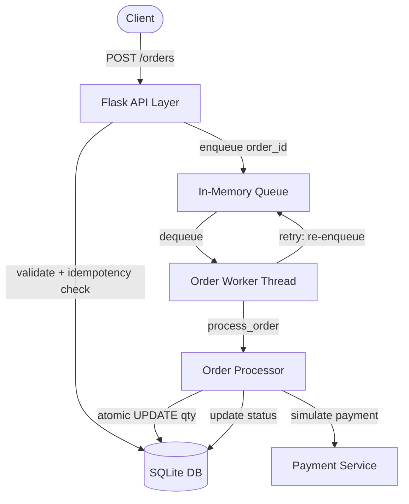
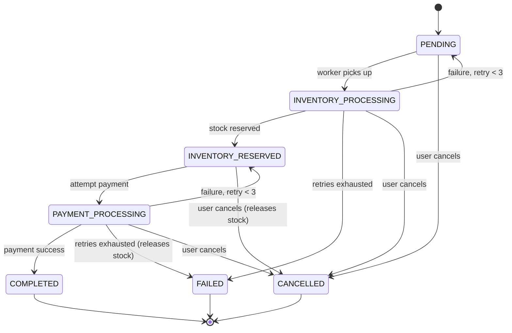
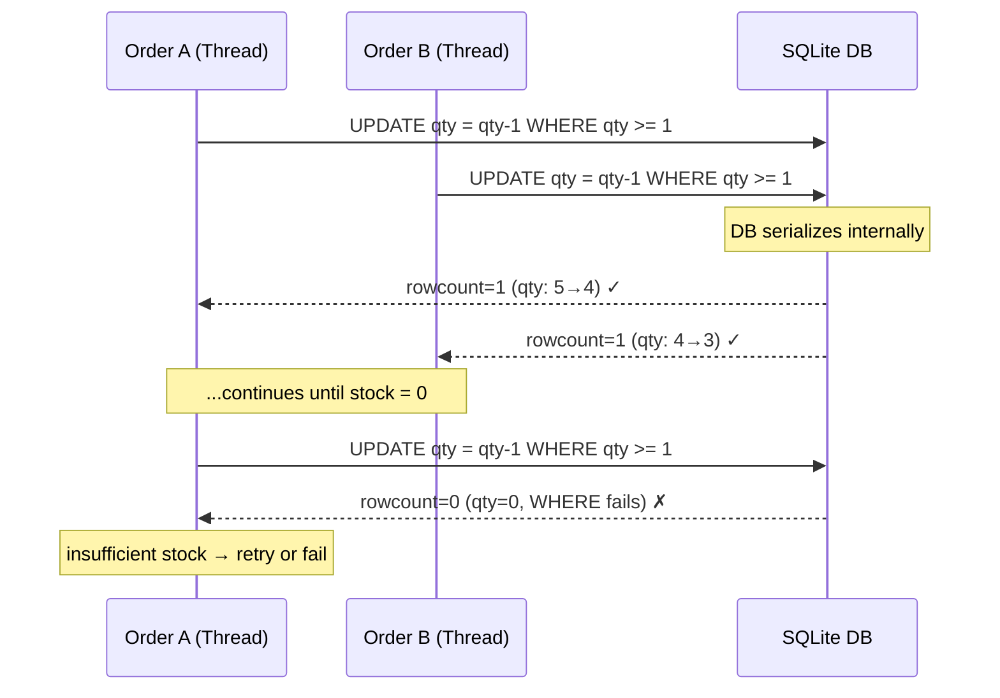

# Design Document: Flask Order Management System

---

## 1. System Architecture

The system is a Flask REST API with a single background worker thread. The HTTP request thread only creates the order and enqueues it — no processing happens in the request cycle. The worker thread does all the heavy lifting.

**Layers:**
- **API Layer:** Flask Blueprints for order endpoints, input validation via Marshmallow.
- **Business Logic Layer:** Services for order processing, payment simulation, and inventory.
- **Worker Layer:** Single background thread with an in-memory queue.
- **Data Layer:** SQLAlchemy models, SQLite database, Alembic migrations.



**Component responsibilities:**

- `routes/order_routes.py` — HTTP only. Validation, idempotency key reading, enqueueing. No business logic.
- `workers/order_worker.py` — Daemon thread polling the queue. Re-enqueues on retry with 2-second backoff.
- `workers/queue.py` — `queue.Queue` wrapper with `timeout=1` so the worker can check a shutdown flag and exit cleanly.
- `services/order_processor.py` — The state machine. All phase transitions and cancellation guards live here.
- `services/inventory_service.py` — Atomic inventory reservation and release via conditional UPDATE.
- `services/payment_service.py` — Simulated payment with 30% failure rate and 1-second delay.

---

## 2. Order State Machine

**States:**

| Status | Description | Terminal | Cancellable |
|---|---|---|---|
| PENDING | Created or retry scheduled | No | Yes |
| INVENTORY_PROCESSING | Attempting inventory reservation | No | Yes |
| INVENTORY_RESERVED | Stock deducted, awaiting payment | No | Yes |
| PAYMENT_PROCESSING | Attempting payment | No | Yes |
| COMPLETED | All steps succeeded | Yes | No |
| FAILED | Retries exhausted | Yes | No |
| CANCELLED | Cancelled by user | Yes | No |



**Key design decision — payment retry resets to `INVENTORY_RESERVED`, not `PENDING`:**

On a payment retry the status resets to `INVENTORY_RESERVED`, not `PENDING`. This means the worker skips the inventory step entirely and retries only the payment. Without this, every payment retry would re-run the inventory check and deduct stock a second time.

---

## 3. Retry Strategy

**Configuration** (`constants/order_constants.py`):
```python
MAX_PAYMENT_RETRIES   = 3
MAX_INVENTORY_RETRIES = 3
```

**Mechanism:** Retries work by re-enqueueing the order. There is no timer or scheduler:

```
process_order() exits with status = PENDING
worker sees PENDING → time.sleep(2) → enqueue_order(order_id)
worker picks it up again on next dequeue
```

**Retry counts are persisted in the DB** (`payment_retry_count`, `inventory_retry_count` columns). Counts survive a worker restart and are visible via `GET /orders/<id>`.

**Idempotency within a retry cycle:**
- Payment is idempotent via `payment_reference` — if already set, payment step is skipped. Prevents double-charging if the worker crashes after payment succeeds but before status is committed.
- Inventory is idempotent via `INVENTORY_RESERVED` status — if already set, inventory step is skipped. Prevents double-deduction on crash recovery.

---

## 4. Concurrency Handling

**The problem:** 10 concurrent orders arrive for an item with 5 units. A naive read-check-write:

```
Thread A reads quantity=5 → 5 >= 1? ok
Thread B reads quantity=5 → 5 >= 1? ok   ← race window
Thread A writes quantity=4
Thread B writes quantity=4                ← wrong, only 1 unit consumed
```

**The solution — atomic conditional UPDATE:**

```sql
UPDATE inventory
SET quantity = quantity - :needed
WHERE item_name = :name
  AND quantity >= :needed
```

The check and write are one SQL statement. No gap. The DB serializes concurrent writes internally — `rowcount=1` means success, `rowcount=0` means out of stock. Works on SQLite, PostgreSQL, MySQL — everywhere.



**Why not `threading.Lock()`?** A lock lives in Python process memory. Under gunicorn with multiple worker processes, each process has its own memory — the lock doesn't exist across processes and protects nothing in a real deployment.

**Why not `with_for_update()`?** Correct in principle, but silently ignored on SQLite. Kept in `order_processor.py` as defence-in-depth for PostgreSQL, but not the primary concurrency guarantee.

**Cancel race condition** uses the same pattern:

```sql
UPDATE orders SET status = 'CANCELLED'
WHERE id = :id AND status NOT IN ('COMPLETED', 'FAILED', 'CANCELLED')
```

If the worker already committed `COMPLETED`, the WHERE fails — `rowcount=0` — and the cancel correctly rejects itself.

**Deadlock prevention:** Items sorted alphabetically before processing. Two orders wanting `[burger, fries]` always attempt `burger` first — consistent ordering eliminates circular waits.

---

## 5. Idempotency

Every `POST /orders` requires an `Idempotency-Key` header. The key is stored on the Order model with a `UNIQUE` DB constraint.

On a duplicate request:
1. Existing order found by `idempotency_key`
2. Returned with `200` — no new order created, no new enqueue

The client generates a UUID per logical request and retries with the same key. The server deduplicates at the DB layer.

---

## 6. Order Cancellation (Phase 8)

Cancellation was added without rewriting the core processor. Guards placed at every point the worker could act on a cancelled order:

1. **Entry guard** — top of `process_order()`: if `CANCELLED`, exit immediately.
2. **Pre-retry guard** — before re-enqueueing on failure: check if cancelled, skip retry.
3. **Post-inventory guard** — after `INVENTORY_RESERVED` commit: refresh from DB, if cancelled call `release_inventory()` and exit.
4. **Cancel route** — atomic `UPDATE ... WHERE status NOT IN (terminals)`.

If an order is cancelled after inventory is reserved, `release_inventory()` returns the stock atomically before the worker exits.

---

## 7. System Failure Scenarios

**Worker crashes mid-processing:**

| State at crash | On restart |
|---|---|
| `PENDING` | Worker picks up again, processes from scratch |
| `INVENTORY_PROCESSING` | Inventory may or may not have been deducted. Worker retries. If already deducted, atomic UPDATE deducts again — potential double-deduction. Known limitation (see Section 9). |
| `INVENTORY_RESERVED` | Worker skips inventory, retries payment only |
| `PAYMENT_PROCESSING` | `payment_reference` check prevents double-charge — if already set, payment step is skipped |

**Retry job runs twice (duplicate enqueue):** Terminal state check in the worker loop skips already-completed orders. `with_for_update()` on PostgreSQL provides additional serialisation.

**DB update succeeds but worker crashes before returning:** DB state is authoritative. On restart the worker re-evaluates from current DB state — idempotency checks prevent re-doing already-completed steps.

---

## 8. Logging

All state transitions logged with structured tags:

```
[STATE_CHANGE]                Every status transition
[INVENTORY_FAILED]            Failed attempt with reason + retry count
[INVENTORY_PERMANENT_FAILURE] Retries exhausted
[INVENTORY_RELEASED]          Stock returned on failure or cancel
[PAYMENT_FAILED]              Failed attempt with reason + retry count
[PAYMENT_PERMANENT_FAILURE]   Retries exhausted
[ORDER_CANCELLED]             Cancel detected mid-processing
[IDEMPOTENCY_HIT]             Duplicate request detected
[WORKER_RETRY]                Order re-enqueued with backoff
[WORKER_ERROR]                Unhandled exception in worker
```

Format: `timestamp | LEVEL | logger_name | [TAG] message`

---

## 9. Tradeoffs & Known Limitations

| Limitation | Impact | Production fix |
|---|---|---|
| In-memory queue | Orders lost on restart | Redis / RabbitMQ |
| SQLite `with_for_update()` no-op | No row-level locking | Move to PostgreSQL |
| Single worker thread | No horizontal scaling | Worker pool or Celery |
| No exponential backoff | Retry storm under load | `min(2**n, 60)` formula |
| Inventory double-deduction on mid-inventory crash | Rare but possible | Add `inventory_deducted` boolean flag to Order |
| No authentication | All endpoints are public | API key or JWT middleware |